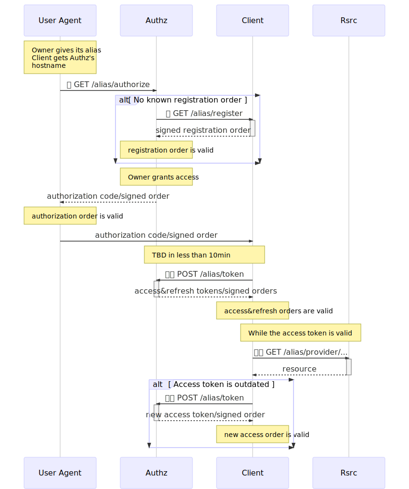

# Alias: Technical draft

Authorization protocol to let parties access user's data for read/write access.
Implemented over [OAuth 2.0][oauth2].

## Brief

*Users* own data, stored as *resources* in *resource servers*. Access to these
resources is controled by the user's *authorization server*. Users are
identified by *aliases*, which is an global identifier.

*Clients* are parties which wish to access users' resources. To do so, one
asks the authorization server to give an access to specific resources, filtered
by *scopes*. The authorization server will ask the user if they grant access to
the client, and if so, the client will ultimately be able to manipulate the
user's resource.

The protocol is implemented over [OAuth 2.0][oauth2]. However, it differs in the
way it is implemented nowadays:

- authorization server and resource server MAY NOT be controled by the same
  party: their relationship SHOULD be stateless.
- tokens MAY NOT be opaque values, but signed orders (see below).
- client registration is done lazily.

## Orders

An order is a JSON object describing a statement which might be or might not be
cryptographically signed by one party. Each order has a least the field `type`
defined to a human-readable value pointing to the type of order (e.g.
`alias/revokation`). If signed, the signer asserts the order's content as true
and must be respected.

The following is an example of an not-signed order:

```json
{

    "type": "alias/...",

    // optional. date when this order was edited
    "edit_date": "2019-03-25T11:18:23.405759"

    // optional. once signed, order expires in 1hour
    "expires_in": 3600,

    "fielda": valuea,
    "fieldb": valueb,
    ...
}
```

A signed order has a additional field `_sig` setting the signer's public key,
the signature date and the signature proof. Here's an example of a signed order:

```json
{
    "type": "alias/...",

    "fielda": valuea,
    "fieldb": valueb,
    ...

    "_sig": {
      "date": "2019-03-25T11:18:23.405759",
      "signer": "ed25519:qfwK28+xFAE7vbBbqQXMgAwgBtz0TI+/ONgsfzaAe4g="
      "proof": "LJzLAyjZhW3BZJcjx/nGMmkaz+acbdcHlTwv1PntP2rlhOiwAA0LpfeUTZVmGUAGqkWXfPKgBY8QA69oRcuzDg==",
    }
}
```

Following orders link to the previous (signed) orders.

```json
{
    "type": "alias/order2",
    "following": {
        "type": "alias/order1",
        "expires_in": 3600,

        "fielda": valuea,
        "fieldb": valueb,
        ...

        "_sig": { ... }
    },

    "fielda": valuea,
    "fieldb": valueb,
    ...

    "_sig": { ... }
}
```

### Order cryptographic hash and signature

Orders are globally identified by a root hash of a [merkle tree][merkle_tree] of
the order's structure.

Let `H` be a function taking as input any digital object and outputs its hash as
a byte array. Let be `S` be a function which takes as input an order to be
signed, a date and a private key, and outputs the signature. Let `⊕` be the
concatenation operator. H is defined as such:

```
// root hash of byte arrays, strings, numbers: H() is any cryptographic hash
// (e.g. Blake2b, SHA-256, ...).
H(bytearray) = CRYPTOHASH(bytearray)
H(string) = CRYPTOHASH(to_utf8(string))
H(number) = CRYPTOHASH(cast_string(number))

// root hash of list: hash of the 2-hashes of the concatenation of indexes and
// values' hashes
H(["foo", 42, "bar", ...]) = H(
    H(H(0) ⊕ H(1) ⊕ H(2) ⊕ ...) ⊕
    H(H("foo") ⊕ H(42) ⊕ H("bar") ⊕ ...)
)

// root hash of dict: hash of the 2-hashes of the concatenation of keys (sorted
// alphabetically if not stated otherwise) and values' hashes
H({"qux": 42, "foo": "bar", ...}) = H(
    H(H("foo") ⊕ H("qux") ⊕ ...) ⊕
    H(H("bar") ⊕ H(42) ⊕ ...)
)

// CRYPTOSIGN may be any assymetric cryptographic signature algorithm.
S(order, date, sk) = CRYPTOSIGN(sk, H({
    "order": order,
    "date": date,
    "signer": PUBLICKEY(sk),
}))

// An signed order is built from the to-be signed order as such
// function sign(order, sk) {
//     let date = now()
//     let proof = S(order, date, sk)
//     order._sig = {
//         "date": date,
//         "signer": PUBLICKEY(sk),
//         "proof": proof,
//     }
// }
}

// root hash of signed order
H({"_sig": signature, "foo": "bar", ...}) = H(
    signature.proof ⊕ H({
        "order": { "foo": "bar", ... },
        "date": signature.date,
        "signer": signature.signer,
    })
)
```

The root hash of an order is the hash of the order as a (JSON) dictionary. It
offers an identifier for orders which is global, (statistically) unique and not
forgeable. As orders may link to previous orders, it asserts [linked
timestamping][linked_timestamping] (i.e. the temporarility of the orders'
signatures). Being a [merkle tree][merkle_tree], it offers a way to authenticate
partial orders, where some branches had been replaced by their root hash to
avoid leaking information unnecessarily.

Note: `H` is heavily inspired from how the Ethereum community build such merkle
tree in smart-contracts.

### Serialization

Orders are serialized as tokens with [MessagePack][msgpack] and URL-safe Base64.

### Validity

An order is said as valid if

- first, if all linked orders are valid (recursive, bottom-up check);
- if signed, the signature is valid;
- its root hash has to be equal to the given one;
- its root hash is not set in a known revokation order;
- if it has a creation date, current time is not before this date;
- if it has a expiration date, current time is not after this date;

### Revokation

An order might be revoked by a revokation order of type `alias/revokation` and
linked to the order to be revoked.

```json
{
    "type": "alias/revokation",
    "revoke": { ... } // order to be revokde.
}
```

Revokation orders does not have an expiration date.

## Security

### Time

All parties must be synchronized to global (Earth 🖖) time. Orders validity rely
on the current time. Any party receiving orders which have an edit-date too much
in the past or in the future should ignore it.

### Revokation

If an valid order is revoked, the revoking party will make a best effort to
contact every party related to the order. When a party discovers an order had
been revoked, it stores the revokation order as long as the revoked order would
had been valid. If a revokation order for a unknown order is received, the party
drops it and notifies so to the revoking party.

If the revokation needs to be asserted, a blockchain (existing or TBD) may be
used to broadcast and permanently store a revokation.

### TLS

When Alice performs a request to Bob, TLS is used to authenticate Alice and Bob.
Both client and server's certificates are sent and checked by both parties.

## Scopes

A scope is a string representing the scope of resources a client can access to.
They are given when a client ask for authorization to access certain resources.
It has the following form:

```
provider.path.to.resource[filter_1,filter_2,...].{field_a,field_b,...}
```

which points to:

- resources provided by the provider `provider`,
- whose parent path is `path.to.resource`,
- filtered by all conditions `filter_1`, `filter_2`, ... which have to be true
  (else filtered out),
- and whose fields `field_a`, `field_b`, ... may be read and/or written.

Here are some special scope construction:

```
// special case: no filters
provider.path.to.resource.{field_a,field_b,...}

// special case: all fields required
provider.path.to.resource[filter_1,filter_2,...].*

// special case: no filters and all fields required
provider.path.to.resource.*
```

For example, the scope `google.photos.*` points to all Google Photos and all its
fields. `google.photos[date>2018,date<2019].{long,lat}` points to the
geolocalization data (fields `long` and `lat`) of all Google Photos taken in
2018.

## Protocol flow



Nomenclature: one 🔑 means a TLS communication where the server certificate is
checked, two 🔑🔑 means a TLS communicate where the client and server
certificates are checked.

Each of the URL cited below have their header `Access-Control-Allow-Origin` set
to `*` for path in `/alias/`.

### Alias nomenclature

An alias is similar to an address email: it is composed of a *username* and the
*authorization server hostname*, as so: john.doe@authz.alias.com.

### Client registration

Clients register lazily to authorization servers. Registration happens during a
authorization request.

Each client edits an order `alias/client_registration` as follow:

```json
{
    "type": "alias/client_registration",
    "client_id": "qfwK28+xFAE7vbBbqQXMgAwgBtz0TI+/ONgsfzaAe4g=",
    "desc": "A sample Alias client for testing purpose.",
    "expires_in": 3600,
    "name": "Sample Alias client",
    "redirect_uri": "https://alias.client.com/alias/cb",
    "url": "https://alias.client.com/"
    "_sig": { ... },
},
```

For one given client, a valid version of this order may be fetched by performing
a HTTP GET request over the URL `https://client_host/alias/register`.

### Authorization request

For a client to request authorization, it is first given the resource owner's
alias (e.g. john.doe@authz.alias.com). From the alias, the client is able to
build the OAuth 2.0 `/authorize` URL (e.g. `https://authz.alias.com/alias/authorize`).

A client perform a GET on this URL with, at least, the following GET arguments:

- `response_type`: set to `code`;
- `client_id`: URI to the client URL order;
- `scope`: A list of scopes, joined by one space.

If the argument `redirect_uri` is set, it has to be the same than the one set in
the client registration order.

Example:

```
GET /alias/authorize?
    response_type=code&
    client_id=https://alias.client.com/alias/&
    scope=google.photos.*&
    redirect_uri=https://alias.client.com/alias/cb
```

### Authorization response

The normal OAuth 2.0 flow happens. If granted, the returned authorization code
is the order `alias/authorization_request` signed with the owner's key:

```json
{
    "type": "alias/authorization_request",
    "response_type": "code",
    "expires_in": 600,    // 10min (max). defined in OAuth 2.0
    "scope": ["google.photos.*"]
    "_sig": { "signer": <owner public key>, ... }
}
```

### Access token request

The client performs a POST request to the authorization server with the path
`/alias/token`. The connection is protected by TLS, both the client and
authorization servers provide their certificate.

Example:

```
POST /alias/token?
    grant_type=authorization_code&
    code=<signed authorization request, serialized>&
    redirect_uri=https://alias.client.com/alias/cb&
    client_id=https://alias.client.com/alias/
```

### Access token response

The normal OAuth 2.0 flow happens. If the authorization request order was valid,
the returned access token is an order `alias/access` signed with the
authorization server's key:

```json
{
    "type": "alias/access",
    "authorization_request": {
        "type": "alias/authorization_request",
        "response_type": "code",
        "expires_in": 600,    // 10min (max). defined in OAuth 2.0
        "scope": ["google.photos.*"]
        "_sig": { "signer": <owner public key>, ... }
    },
    "expires_in": 3600,   // 1h, depends on the access token lifetime
    "scope": ["google.photos.*"]
    "_sig": { "signer": <authorization server public key>, ... }
}
```

The field `authorization_request` stores the previous signed order
`alias/authorization_request` granted by the user. It does not have to be sent
with the access token but just its root hash.

The returned refresh token is the root hash of the order `alias/refresh` signed
with the authorization server's key (too).

```json
{
    "type": "alias/refresh",
    "authorization_request": {
        "type": "alias/authorization_request",
        "response_type": "code",
        "expires_in": 600,    // 10min (max). defined in OAuth 2.0
        "scope": ["google.photos.*"]
        "_sig": { "signer": <owner public key>, ... }
    },
    "_sig": { "signer": <authorization server public key>, ... }
}
```

The last order content is stored by the authorization server and never known by
other parties. Revokation happens by removing the refresh token.

### Refresh token

Same than OAuth 2.0

## Resource access

XXX

[merkle_tree]: https://en.wikipedia.org/wiki/Merkle_tree
[msgpack]: https://msgpack.org/
[oauth2]: https://tools.ietf.org/html/rfc6749
[linked_timestamping]: https://en.wikipedia.org/wiki/Linked_timestamping

